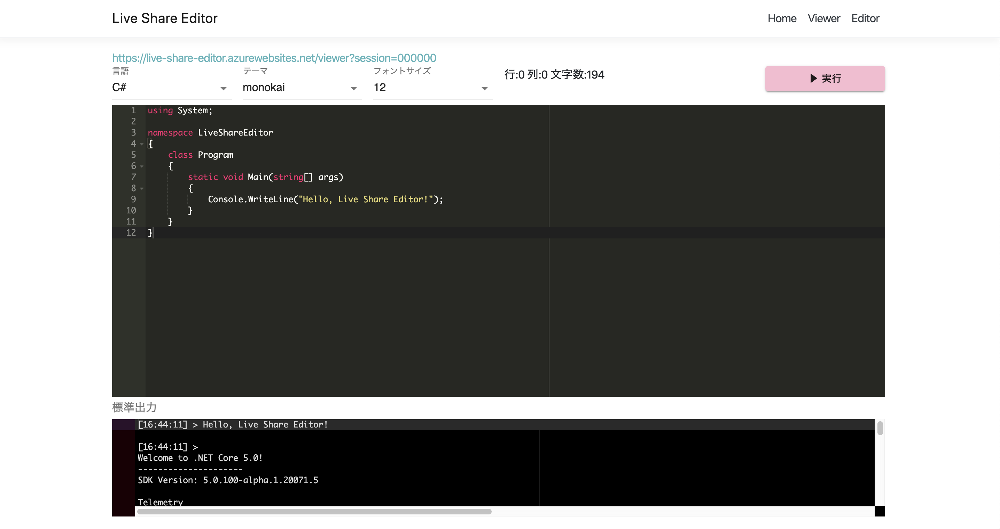

# LiveShareEditor

[](https://github.com/kadoshita/live-share-editor)
[](https://opensource.org/licenses/MIT)


[](https://live-share-editor.azurewebsites.net/)
[](https://live-share-editor.azurewebsites.net/)

ソースコードをリアルタイムで共有できるオンラインエディタ



# 概要
Live Share Editorは1:Nでコーディングの状況をリアルタイムに配信できるオンラインテキストエディタです。
以下の機能を実装しています。
## 機能
1. 各種言語のシンタックスハイライト
1. カラーテーマの設定
1. ブラウザ上での実行結果の確認

# 動作確認済み環境
* .NET Core SDK 3.1.100
* Node.js v10.16.3

# 実行

```sh
git clone https://github.com/kadoshita/live-share-editor.git
cd live-share-editor/ClientApp
npm i
cd ../../
dotnet run
```

# 不具合報告
GitHubのIssuesに投稿してください。

# 機能追加要望
GitHubのIssuesに投稿してください。

# コントリビュート
Pull Requestは随時受け付けています。

# ライセンス
MIT
```
MIT License

Copyright (c) 2020 Yoshiki Kadoshita

Permission is hereby granted, free of charge, to any person obtaining a copy
of this software and associated documentation files (the "Software"), to deal
in the Software without restriction, including without limitation the rights
to use, copy, modify, merge, publish, distribute, sublicense, and/or sell
copies of the Software, and to permit persons to whom the Software is
furnished to do so, subject to the following conditions:

The above copyright notice and this permission notice shall be included in all
copies or substantial portions of the Software.

THE SOFTWARE IS PROVIDED "AS IS", WITHOUT WARRANTY OF ANY KIND, EXPRESS OR
IMPLIED, INCLUDING BUT NOT LIMITED TO THE WARRANTIES OF MERCHANTABILITY,
FITNESS FOR A PARTICULAR PURPOSE AND NONINFRINGEMENT. IN NO EVENT SHALL THE
AUTHORS OR COPYRIGHT HOLDERS BE LIABLE FOR ANY CLAIM, DAMAGES OR OTHER
LIABILITY, WHETHER IN AN ACTION OF CONTRACT, TORT OR OTHERWISE, ARISING FROM,
OUT OF OR IN CONNECTION WITH THE SOFTWARE OR THE USE OR OTHER DEALINGS IN THE
SOFTWARE.
```